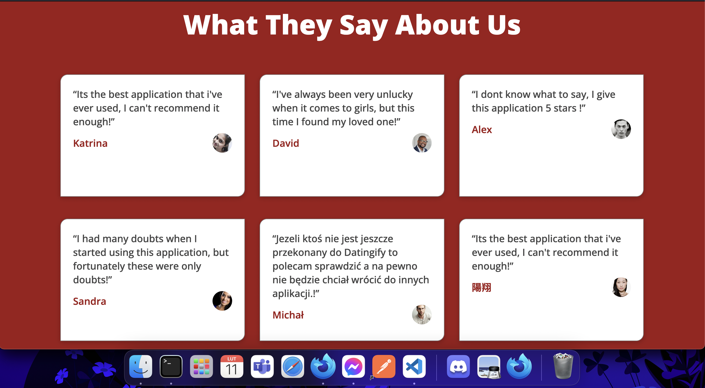
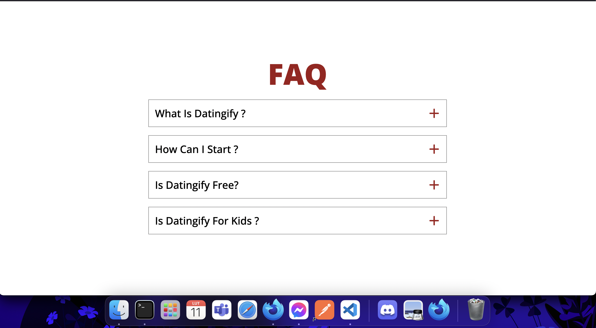
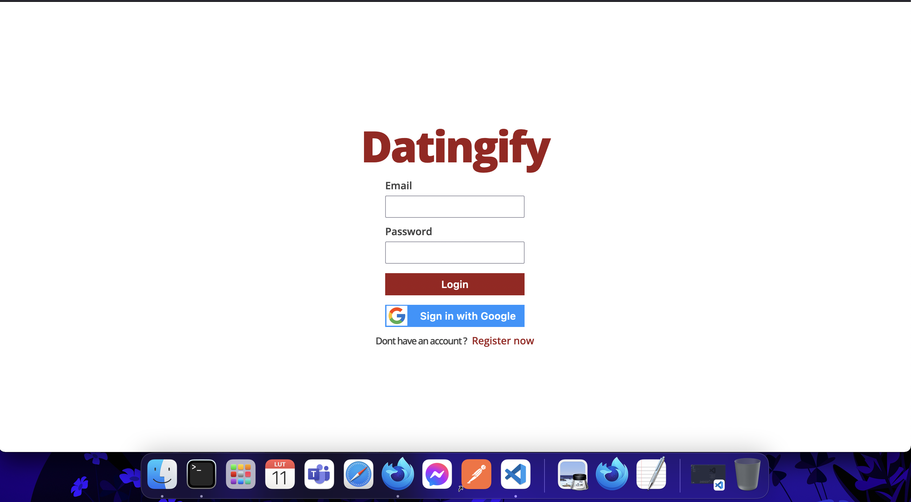
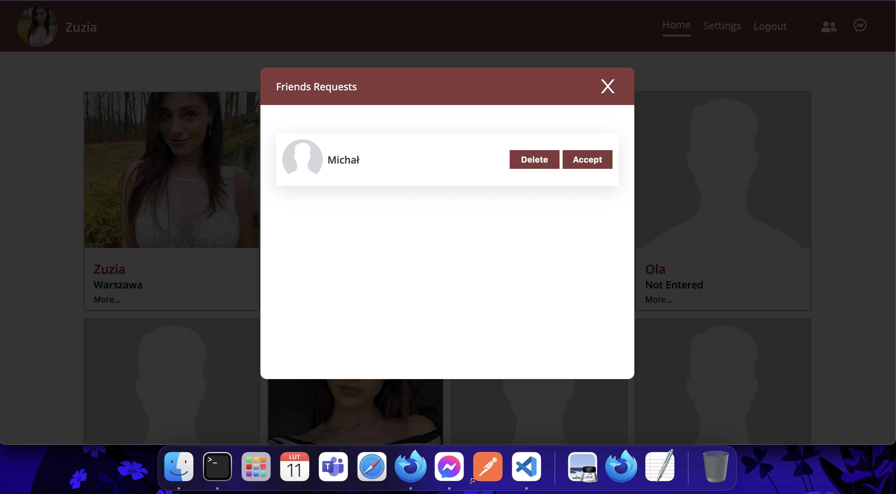
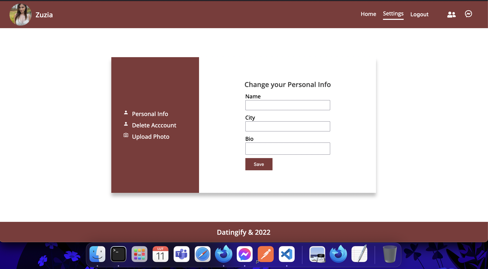
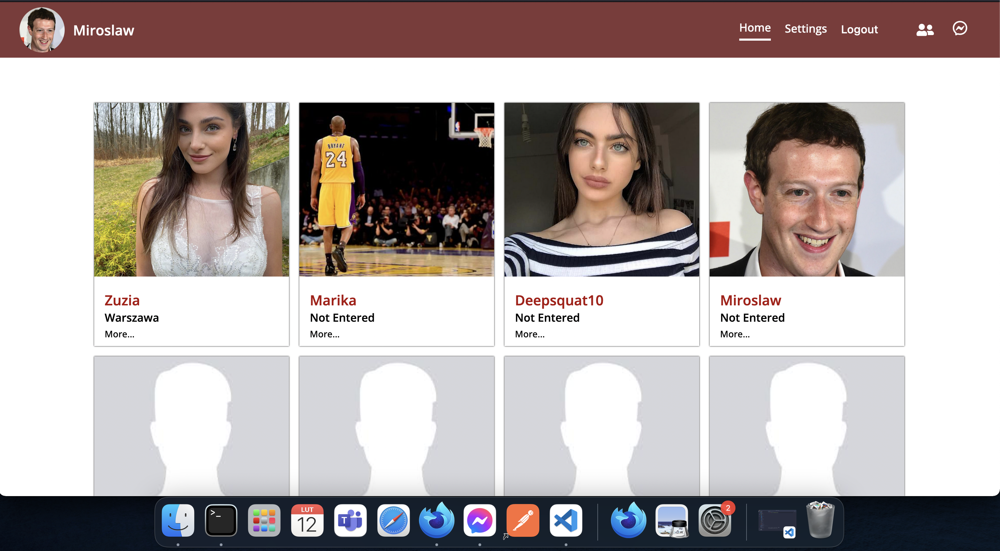
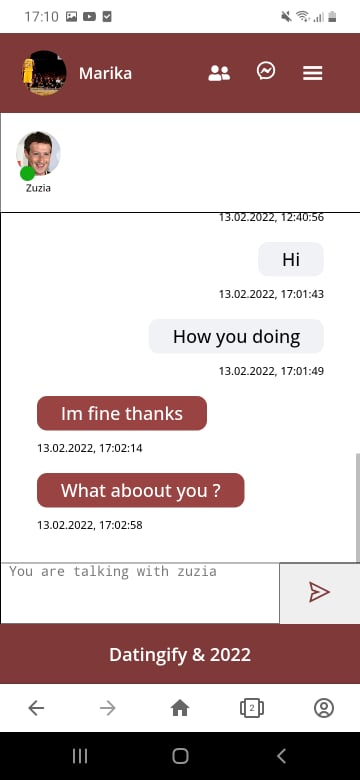

# DATINGIFY

Datingify is an online dating application.

# LINK TO WEBISTE

https://happy-jang-20aa9a.netlify.app/

If you want to login to my application you can use this sample account:

email: user@gmail.com

password: 123456

# Features

- Create and delete account
- OAuth login with Google
- Update profile image
- Add and delete user from friends list
- Real-time chat
- Real-time notifications

# What I use to build this app

- HTML
- CSS
- JAVA SCRIPT / REACT
- NODE JS
- EXPRESS
- MONGODB

# Reflections

- I wasn't stricte with naming convention when it comes to CSS, if i had a chance to do this project again I would probably go for BEM naming convention or go with STYLED COMPONENTS it would also help to make JSX less bulky.

- Images are stored on the server which is not good, but if I had a budget it would be definitely something like AWS.

- The hardest part of creating this app was design, it was always weak point of mine since im not desinger, I could probably copy design from other sites, but I wanted something mine.

- Overall I'm happy with this project, I learned a lot and I hope that my future projects will be even better.

# Screenshots

